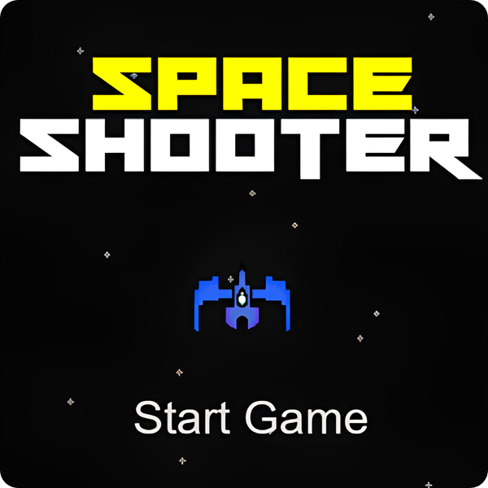

# 🚀 Galactic Combat, A Game Made Using Arcade Library

This is a fun and exciting 2D Space Shooter Game developed using the Arcade library in Python. Players control a spaceship, navigating through space while dodging obstacles and shooting enemies to score points.

# Alpha Version 1.0:
- Scoring System
- Multiple Enemies
- Multiple Powerups
- Simple Menu To Navigate

# 🕹️ Preview:

# Features:
- Smooth spaceship controls
- Dynamic enemy movement and firing
- Real-time score tracking
- Fun retro-style space theme with custom textures

# Tech Stack:
- Language: Python
- Graphics: Arcade library
- Platform: Cross-platform (Windows, Linux, MacOS)
- Will Use Webassembly For Mobile Platforms And Online Browser Gameplay

Feel free to check out the code and contribute!
Changes in progress...

